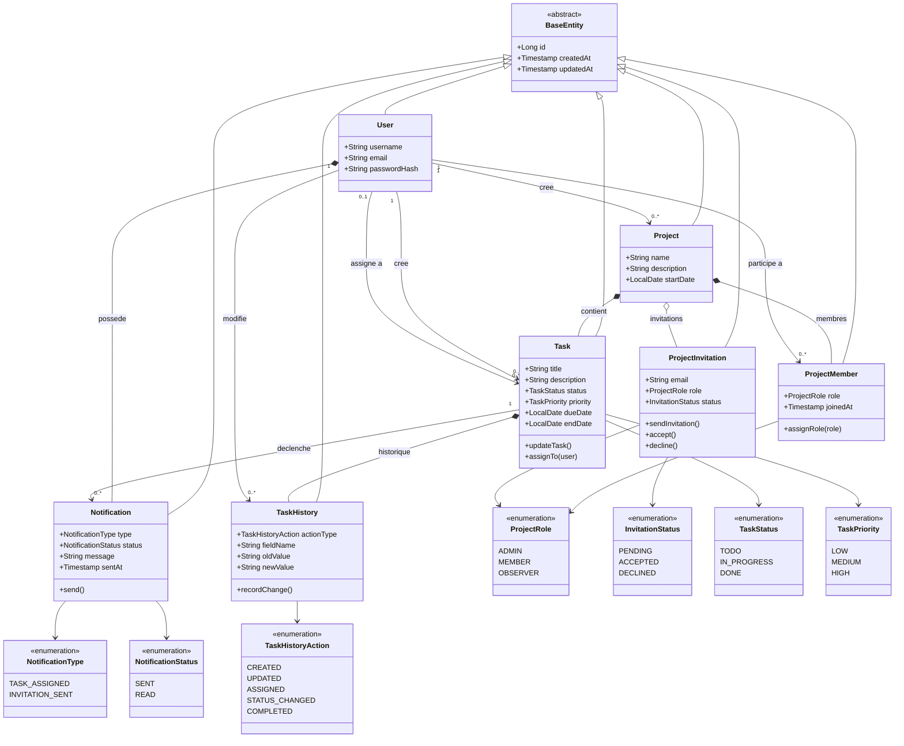

# PMT

Application de gestion de projet composee d'un frontend Angular et d'un backend Spring Boot.

## Architecture Globale

Le projet est organise autour de 4 zones principales :

```text
pmt/
├── backend/
├── frontend/
├── database/
├── docs/
├── .github/workflows/
├── docker-compose.yml
└── README.md
```

- `backend/` : API REST Spring Boot, logique metier, acces base de donnees et tests Java.
- `frontend/` : application Angular/Nx, interface utilisateur, proxy de dev vers l'API.
- `database/` : ressources et artefacts lies a la base locale.
- `docs/` : documentation technique et collection Postman.
- `.github/workflows/` : futur emplacement des pipelines CI/CD.
- `docker-compose.yml` : demarrage de PostgreSQL et du backend en conteneurs.

## Vue D'Ensemble Technique

### Backend

- Stack : Java 17, Spring Boot 3, Spring Web, Spring Data JPA, Spring Security, PostgreSQL.
- Port local : `8081`
- Base principale : PostgreSQL
- Tests : JUnit / Spring Boot Test / H2

Le backend expose des endpoints REST pour :

- `users`
- `projects`
- `project-members`
- `project-invitations`
- `tasks`
- `task-histories`
- `notifications`

### Diagramme De Classes



### Frontend

- Stack : Angular 19, Nx, TypeScript, SCSS, Tailwind CSS.
- Port local : `4200`
- Proxy de dev : `/api` vers `http://localhost:8081`

Le frontend propose aujourd'hui :

- inscription
- connexion simple par email
- persistance de session en `localStorage`
- dashboard avec projets et taches
- creation de projets et de taches

## Installation

### Prerequis

- Java 17
- Node.js 20.19.0 LTS minimum
- npm
- Docker Desktop

### Version de Node recommandee

Le frontend cible explicitement `Node 20.19.0 LTS`.

Avec `nvm` sous Windows :

```powershell
nvm install 20.19.0
nvm use 20.19.0
node -v
```

Le projet contient aussi un fichier `.nvmrc` a la racine et dans `frontend/`.

### Variables d'environnement

Copier `.env.example` vers `.env` si besoin, puis verifier :

```env
POSTGRES_DB=pmtdb
POSTGRES_USER=admin
POSTGRES_PASSWORD=admin
SPRING_DATASOURCE_URL=jdbc:postgresql://postgres:5432/pmtdb
SPRING_DATASOURCE_USERNAME=admin
SPRING_DATASOURCE_PASSWORD=admin
APP_FRONTEND_BASE_URL=http://localhost:4200
APP_MAIL_FROM=no-reply@pmt.local
SPRING_MAIL_HOST=
SPRING_MAIL_PORT=587
SPRING_MAIL_USERNAME=
SPRING_MAIL_PASSWORD=
SPRING_MAIL_PROPERTIES_MAIL_SMTP_AUTH=true
SPRING_MAIL_PROPERTIES_MAIL_SMTP_STARTTLS_ENABLE=true
```

Pour activer un vrai envoi d'email pour les invitations, il faut renseigner la configuration SMTP.

Exemple avec Mailtrap :

```env
SPRING_MAIL_HOST=sandbox.smtp.mailtrap.io
SPRING_MAIL_PORT=2525
SPRING_MAIL_USERNAME=ton_username_mailtrap
SPRING_MAIL_PASSWORD=ton_password_mailtrap
APP_MAIL_FROM=no-reply@pmt.local
```

Si `SPRING_MAIL_HOST` reste vide, le backend n'envoie pas de vrai mail et journalise simplement le lien d'invitation dans la console.

### Installation des dependances

Frontend :

```powershell
Set-Location .\frontend
npm install
```

Backend :

```powershell
Set-Location ..\backend
.\mvnw.cmd -q -DskipTests dependency:go-offline
```

Cette commande prepare les dependances Maven du backend.

Pour verifier ensuite que le backend compile et que les tests passent :

```powershell
.\mvnw.cmd test
```

Important :

- `.\mvnw.cmd test` ne demarre pas le backend Docker
- `.\mvnw.cmd test` n'a pas besoin que `docker compose` tourne
- les tests backend utilisent une base H2 en memoire dans `backend/src/test/resources/`
- apres avoir arrete `.\start-dev.ps1`, tu peux relancer `.\mvnw.cmd test` dans le meme terminal sans ecraser la datasource du profil `test`

## Demarrage Du Projet

### Option 1 : demarrage local front + back

Depuis la racine :

```powershell
powershell -ExecutionPolicy Bypass -File .\start-dev.ps1
```

Ce script :

- charge les variables du fichier `.env`
- adapte `SPRING_DATASOURCE_URL` vers `localhost:5433` quand le backend tourne en local
- demarre le service `postgres` de `docker compose` si necessaire
- verifie que Node 20.19.0 LTS minimum est actif
- lance le frontend dans une nouvelle fenetre PowerShell
- lance le backend dans le terminal courant
- restaure les variables d'environnement de la session quand le backend s'arrete

Application disponible sur :

- Frontend : `http://localhost:4200`
- Backend : `http://localhost:8081`

### Option 2 : demarrage separe

Backend :

```powershell
Set-Location .\backend
.\mvnw.cmd spring-boot:run
```

Frontend :

```powershell
Set-Location .\frontend
npm start
```

Important :

- cette option ne charge pas automatiquement le fichier `.env` a la racine
- si tu veux tester les invitations email avec SMTP en demarrage separe, il faut soit passer par `.\start-dev.ps1`, soit exporter les variables d'environnement manuellement avant de lancer Spring Boot

## Comptes De Demo

Au demarrage du backend, 3 comptes de demonstration sont seedes pour tester rapidement la connexion et les roles de projet.

Mot de passe commun :

```text
demo123
```

- `alice.admin@pmt.local` : role `ADMIN` sur le projet `PMT Launch`
- `bob.member@pmt.local` : role `MEMBER` sur le projet `PMT Launch`
- `claire.observer@pmt.local` : role `OBSERVER` sur le projet `Mobile Refresh`

Important :

- ces roles sont des roles de membership par projet, pas des roles globaux utilisateur
- si le backend tournait deja avant la modification, redemarre-le pour reappliquer `backend/src/main/resources/data.sql`

### Option 3 : backend + base via Docker

Depuis la racine :

```powershell
docker compose up --build
```

Cela demarre :

- PostgreSQL sur `localhost:5433`
- le backend sur `http://localhost:8081`

Le frontend reste a lancer localement avec `npm start`.

## Commandes Utiles

Frontend :

```powershell
Set-Location .\frontend
npm start
npm run build
npm run test
npm run test:e2e
```

Backend :

```powershell
Set-Location .\backend
.\mvnw.cmd spring-boot:run
.\mvnw.cmd test
```

## CI/CD

Le depot contient un workflow GitHub Actions dans [`.github/workflows/ci-cd.yml`](.github/workflows/ci-cd.yml).

Ce pipeline :

- lance les tests backend Maven
- lance les tests frontend Angular
- build les images Docker backend et frontend
- push les images sur Docker Hub uniquement lors d'un `push` sur `main`

Secrets GitHub Actions obligatoires :

```text
DOCKERHUB_USERNAME
DOCKERHUB_TOKEN
```

Variables GitHub Actions optionnelles :

```text
DOCKERHUB_BACKEND_IMAGE
DOCKERHUB_FRONTEND_IMAGE
```

Si ces variables ne sont pas definies, le workflow utilisera par defaut :

```text
<DOCKERHUB_USERNAME>/pmt-backend
<DOCKERHUB_USERNAME>/pmt-frontend
```

Le frontend dispose maintenant d'un conteneur Nginx dans [`frontend/Dockerfile`](frontend/Dockerfile).
Par defaut, il attend un backend HTTP disponible via la variable d'environnement runtime :

```text
API_UPSTREAM=http://backend:8081
```

Cette variable sert au proxy Nginx pour les appels `/api`.

## Documentation

- Collection Postman : `docs/postman/`
- Configuration Docker : `docker-compose.yml`
- Variables d'environnement d'exemple : `.env.example`

## Points D'Attention

Les principaux contrats frontend/backend ont ete alignes :

- la connexion passe maintenant par `POST /auth/login` avec verification reelle du mot de passe cote backend
- la creation de projet envoie bien `ownerId`
- le frontend reutilise les memes enums de base que le backend pour les statuts et priorites exposes
- le service API frontend normalise les objets lies du backend en champs exploitables par l'interface comme `projectId`, `assignedToId` et `createdById`
- les invitations de projet peuvent maintenant passer par email avec un lien `/invitation/:token`
- le mail part vraiment seulement si SMTP est configure dans `.env`

Il reste encore possible d'ameliorer le projet sur des aspects produit ou UX, mais la base de communication entre front et back est maintenant coherente.
