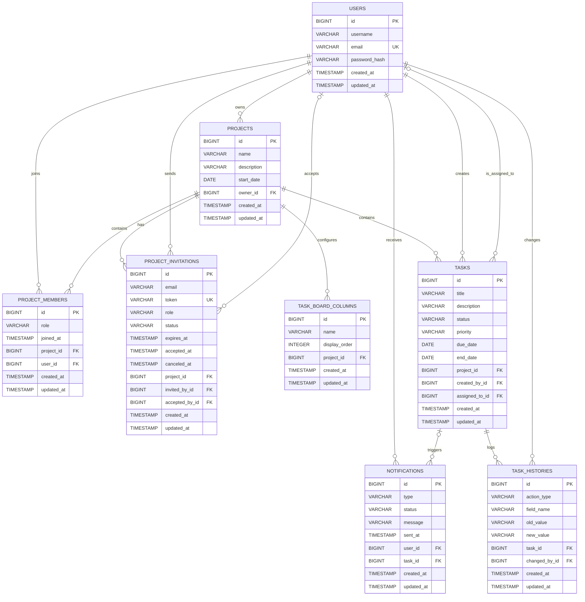

# PMT

Application de gestion de projet composée d'un frontend Angular et d'un backend Spring Boot.

## Architecture globale

Le projet est organisé autour de 4 zones principales :

```text
pmt/
├── backend/
├── frontend/
├── database/
├── docs/
├── .github/workflows/
├── docker-compose.yml
└── README.md
```

- `backend/` : API REST Spring Boot, logique métier, accès à la base de données et tests Java
- `frontend/` : application Angular/Nx, interface utilisateur, proxy de développement vers l'API
- `database/` : ressources et artefacts liés à la base locale
- `docs/` : documentation technique et collection Postman
- `.github/workflows/` : futur emplacement des pipelines CI/CD
- `docker-compose.yml` : démarrage de PostgreSQL et du backend en conteneurs

## Vue d'ensemble technique

### Backend

- Stack : Java 17, Spring Boot 3, Spring Web, Spring Data JPA, Spring Security, PostgreSQL
- Port local : `8081`
- Base principale : PostgreSQL
- Tests : JUnit / Spring Boot Test / H2

Le backend expose des endpoints REST pour :

- `users`
- `projects`
- `project-members`
- `project-invitations`
- `tasks`
- `task-histories`
- `notifications`

### Diagramme de classes


### Schéma de base de données

Le diagramme ci-dessous reprend la structure relationnelle versionnée dans `database/migrations/V1__initial_schema_postgresql.sql`.



Contraintes importantes de conception :

- `users.email` est unique
- `project_members (project_id, user_id)` est unique
- `project_invitations.token` est unique
- `task_board_columns (project_id, name)` est unique
- `assigned_to_id`, `accepted_by_id` et `task_id` dans `notifications` sont optionnels
- les rôles et statuts sont contrôlés par des `CHECK`

#### Nullabilité et contraintes

| Table | Champs obligatoires | Champs optionnels | Contraintes notables |
| --- | --- | --- | --- |
| `users` | `username`, `email`, `password_hash` | `created_at`, `updated_at` | `email` unique |
| `projects` | `name` | `description`, `start_date`, `owner_id`, `created_at`, `updated_at` | `owner_id` référence `users.id` |
| `project_members` | `role`, `project_id`, `user_id` | `joined_at`, `created_at`, `updated_at` | unicité `(project_id, user_id)` |
| `project_invitations` | `email`, `role`, `status`, `project_id`, `invited_by_id` | `token`, `expires_at`, `accepted_at`, `canceled_at`, `accepted_by_id`, `created_at`, `updated_at` | `token` unique |
| `task_board_columns` | `name`, `project_id` | `display_order`, `created_at`, `updated_at` | unicité `(project_id, name)` |
| `tasks` | `title`, `status`, `priority`, `project_id`, `created_by_id` | `description`, `due_date`, `end_date`, `assigned_to_id`, `created_at`, `updated_at` | `assigned_to_id` nullable |
| `task_histories` | `action_type`, `field_name`, `task_id`, `changed_by_id` | `old_value`, `new_value`, `created_at`, `updated_at` | historisation des changements |
| `notifications` | `type`, `status`, `message`, `user_id` | `sent_at`, `task_id`, `created_at`, `updated_at` | `task_id` nullable |

#### Valeurs contrôlées par le modèle

| Champ | Valeurs attendues |
| --- | --- |
| `project_members.role` | `ADMIN`, `MEMBER`, `OBSERVER` |
| `project_invitations.role` | `ADMIN`, `MEMBER`, `OBSERVER` |
| `project_invitations.status` | `PENDING`, `ACCEPTED`, `DECLINED`, `EXPIRED`, `CANCELED` |
| `tasks.priority` | `LOW`, `MEDIUM`, `HIGH` |
| `task_histories.action_type` | `CREATED`, `UPDATED`, `ASSIGNED`, `STATUS_CHANGED`, `COMPLETED` |
| `notifications.type` | `TASK_ASSIGNED`, `INVITATION_SENT` |
| `notifications.status` | `SENT`, `READ` |

#### Règles métier

- un projet possède un propriétaire via `projects.owner_id`
- un utilisateur peut appartenir à plusieurs projets via `project_members`
- une invitation de projet est reliée à un projet, à un émetteur et éventuellement à un utilisateur ayant accepté
- une tâche appartient à un seul projet et peut être assignée à un utilisateur du projet
- l'historique des tâches permet de tracer qui a modifié quoi et quand
- une notification peut être liée à une tâche, mais ce n'est pas obligatoire

### Frontend

- Stack : Angular 19, Nx, TypeScript, SCSS, Tailwind CSS
- Port local : `4200`
- Proxy de développement : `/api` vers `http://localhost:8081`

Le frontend propose aujourd'hui :

- inscription
- connexion simple par email
- persistance de session en `localStorage`
- dashboard avec projets et tâches
- création de projets et de tâches

## Installation

### Prérequis

- Java 17
- Node.js 20.19.0 LTS minimum
- npm
- Docker Desktop

### Version de Node recommandée

Le frontend cible explicitement `Node 20.19.0 LTS`.

Avec `nvm` sous Windows :

```powershell
nvm install 20.19.0
nvm use 20.19.0
node -v
```

Le projet contient aussi un fichier `.nvmrc` à la racine et dans `frontend/`.

### Variables d'environnement

Copier `.env.example` vers `.env` si besoin, puis vérifier :

```env
POSTGRES_DB=pmtdb
POSTGRES_USER=admin
POSTGRES_PASSWORD=admin
SPRING_DATASOURCE_URL=jdbc:postgresql://postgres:5432/pmtdb
SPRING_DATASOURCE_USERNAME=admin
SPRING_DATASOURCE_PASSWORD=admin
APP_FRONTEND_BASE_URL=http://localhost:4200
APP_MAIL_FROM=no-reply@pmt.local
SPRING_MAIL_HOST=
SPRING_MAIL_PORT=587
SPRING_MAIL_USERNAME=
SPRING_MAIL_PASSWORD=
SPRING_MAIL_PROPERTIES_MAIL_SMTP_AUTH=true
SPRING_MAIL_PROPERTIES_MAIL_SMTP_STARTTLS_ENABLE=true
```

Pour activer un vrai envoi d'email pour les invitations, il faut renseigner la configuration SMTP.

Exemple avec Mailtrap :

```env
SPRING_MAIL_HOST=sandbox.smtp.mailtrap.io
SPRING_MAIL_PORT=2525
SPRING_MAIL_USERNAME=ton_username_mailtrap
SPRING_MAIL_PASSWORD=ton_password_mailtrap
APP_MAIL_FROM=no-reply@pmt.local
```

Si `SPRING_MAIL_HOST` reste vide, le backend n'envoie pas de vrai mail et journalise simplement le lien d'invitation dans la console.

### Installation des dépendances

Frontend :

```powershell
Set-Location .\frontend
npm install
```

Backend :

```powershell
Set-Location ..\backend
.\mvnw.cmd -q -DskipTests dependency:go-offline
```

Cette commande prépare les dépendances Maven du backend.

Pour vérifier ensuite que le backend compile et que les tests passent :

```powershell
.\mvnw.cmd test
```

À retenir :

- `.\mvnw.cmd test` ne démarre pas le backend Docker
- `.\mvnw.cmd test` n'a pas besoin que `docker compose` tourne
- les tests backend utilisent une base H2 en mémoire dans `backend/src/test/resources/`
- après avoir arrêté `.\start-dev.ps1`, tu peux relancer `.\mvnw.cmd test` dans le même terminal sans écraser la datasource du profil `test`

## Démarrage du projet

### Option 1 : démarrage local front + back

Depuis la racine :

```powershell
powershell -ExecutionPolicy Bypass -File .\start-dev.ps1
```

Ce script :

- charge les variables du fichier `.env`
- adapte `SPRING_DATASOURCE_URL` vers `localhost:5433` quand le backend tourne en local
- démarre le service `postgres` de `docker compose` si nécessaire
- vérifie que Node 20.19.0 LTS minimum est actif
- lance le frontend dans une nouvelle fenêtre PowerShell
- lance le backend dans le terminal courant
- restaure les variables d'environnement de la session quand le backend s'arrête

Application disponible sur :

- Frontend : `http://localhost:4200`
- Backend : `http://localhost:8081`

### Option 2 : démarrage séparé

Backend :

```powershell
Set-Location .\backend
.\mvnw.cmd spring-boot:run
```

Frontend :

```powershell
Set-Location .\frontend
npm start
```

À retenir :

- cette option ne charge pas automatiquement le fichier `.env` à la racine
- si tu veux tester les invitations email avec SMTP en démarrage séparé, il faut soit passer par `.\start-dev.ps1`, soit exporter les variables d'environnement manuellement avant de lancer Spring Boot

## Comptes de démo

Au démarrage du backend, 3 comptes de démonstration sont seedés pour tester rapidement la connexion et les rôles de projet.

Mot de passe commun :

```text
demo123
```

- `alice.admin@pmt.local` : rôle `ADMIN` sur le projet `PMT Launch`
- `bob.member@pmt.local` : rôle `MEMBER` sur le projet `PMT Launch`
- `claire.observer@pmt.local` : rôle `OBSERVER` sur le projet `Mobile Refresh`

À retenir :

- ces rôles sont des rôles de membership par projet, pas des rôles globaux utilisateur
- si le backend tournait déjà avant la modification, redémarre-le pour réappliquer `backend/src/main/resources/data.sql`

### Option 3 : backend + base via Docker

Depuis la racine :

```powershell
docker compose up --build
```

Cela démarre :

- PostgreSQL sur `localhost:5433`
- le backend sur `http://localhost:8081`

Le frontend reste à lancer localement avec `npm start`.

## Commandes utiles

Frontend :

```powershell
Set-Location .\frontend
npm start
npm run build
npm run test
npm run test:e2e
```

Backend :

```powershell
Set-Location .\backend
.\mvnw.cmd spring-boot:run
.\mvnw.cmd test
```

## Tests

### Frontend unitaires

Depuis `frontend/` :

```powershell
npm run test
```

Pour lancer la suite Angular en mode CI avec Chrome headless :

```powershell
npm run test:unit
```

### Frontend end-to-end avec Playwright

Depuis `frontend/` :

```powershell
npm run test:e2e
```

À retenir :

- Playwright démarre automatiquement le frontend sur `http://127.0.0.1:4200`
- les tests e2e mockent les appels `/api`, donc le backend n'a pas besoin d'être lancé
- la configuration est dans `frontend/playwright.config.ts`
- les scénarios sont dans `frontend/e2e/`

Première installation sur une machine :

```powershell
Set-Location .\frontend
npm install
npx playwright install
```

Variantes utiles :

```powershell
npm run test:e2e -- --headed
npx playwright test --ui
```

### Couverture des user stories par les tests e2e

Les tests Playwright couvrent les parcours métier principaux suivants :

- inscription visiteur : `frontend/e2e/register.spec.ts`
- connexion utilisateur : `frontend/e2e/login.spec.ts`
- création de projet : `frontend/e2e/dashboard.spec.ts`
- invitation d'un membre par email : `frontend/e2e/dashboard.spec.ts`
- attribution / mise à jour d'un rôle membre : `frontend/e2e/dashboard.spec.ts`
- création de tâche : `frontend/e2e/dashboard.spec.ts`
- assignation de tâche : `frontend/e2e/dashboard.spec.ts`
- mise à jour de tâche avec date de fin : `frontend/e2e/dashboard.spec.ts`
- consultation du détail d'une tâche : `frontend/e2e/dashboard.spec.ts`
- visualisation des tâches par statut sur le board : `frontend/e2e/dashboard.spec.ts`
- consultation des notifications applicatives : `frontend/e2e/dashboard.spec.ts`
- consultation de l'historique avec filtrage par projet et par visibilité : `frontend/e2e/dashboard.spec.ts`

Note sur la user story email :

- le parcours Playwright vérifie bien l'assignation et l'apparition de la notification dans l'application
- l'envoi d'email lui-même est vérifié côté backend par les tests Java, notamment `backend/src/test/java/com/mooc/formulaone/NotificationServiceImplTest.java`

## CI/CD

Le dépôt contient un workflow GitHub Actions dans [`.github/workflows/ci-cd.yml`](.github/workflows/ci-cd.yml).

Ce pipeline :

- lance les tests backend Maven
- lance les tests frontend Angular
- lance les tests end-to-end Playwright du frontend
- build les images Docker backend et frontend
- push les images sur Docker Hub uniquement lors d'un `push` sur `main`

Secrets GitHub Actions obligatoires :

```text
DOCKERHUB_USERNAME
DOCKERHUB_TOKEN
```

Variables GitHub Actions optionnelles :

```text
DOCKERHUB_BACKEND_IMAGE
DOCKERHUB_FRONTEND_IMAGE
```

Si ces variables ne sont pas définies, le workflow utilisera par défaut :

```text
<DOCKERHUB_USERNAME>/pmt-backend
<DOCKERHUB_USERNAME>/pmt-frontend
```

Le frontend dispose maintenant d'un conteneur Nginx dans [`frontend/Dockerfile`](frontend/Dockerfile).
Par défaut, il attend un backend HTTP disponible via la variable d'environnement runtime :

```text
API_UPSTREAM=http://backend:8081
```

Cette variable sert au proxy Nginx pour les appels `/api`.

## Documentation

- Collection Postman : `docs/postman/`
- Schéma BDD versionné : `database/migrations/V1__initial_schema_postgresql.sql`
- Configuration Docker : `docker-compose.yml`
- Variables d'environnement d'exemple : `.env.example`

## Points clés

Les principaux contrats frontend/backend ont été alignés :

- la connexion passe maintenant par `POST /auth/login` avec vérification réelle du mot de passe côté backend
- la création de projet envoie bien `ownerId`
- le frontend réutilise les mêmes enums de base que le backend pour les statuts et priorités exposés
- le service API frontend normalise les objets liés du backend en champs exploitables par l'interface comme `projectId`, `assignedToId` et `createdById`
- les invitations de projet peuvent maintenant passer par email avec un lien `/invitation/:token`
- le mail part vraiment seulement si SMTP est configuré dans `.env`

Il reste encore possible d'améliorer le projet sur des aspects produit ou UX, mais la base de communication entre front et back est maintenant cohérente.
